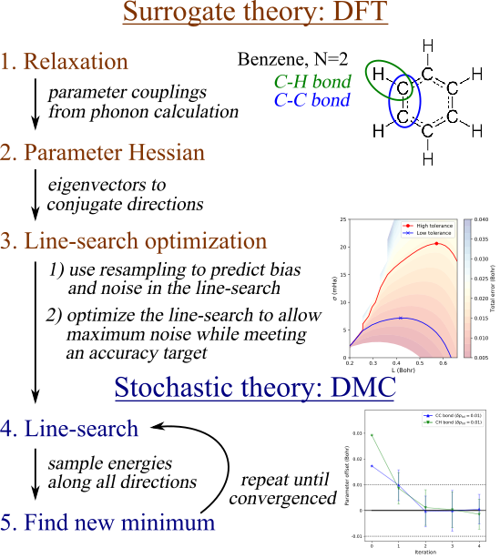

# Documentation for Surrogate Hessian Relax

Surrogate Hessian Relax is a Python implementation of The Surrogate Hessian
Accelerated Parallel Line-search. The method is inteded for optimizing and
performing energy minimization of atomic structures in the presence of
statistical noise.

NOTE: the implementation is currently in an early stage of development.
Therefore, the documentation is comprehensive and parts of it may change and
become obsolete over the course of the development.


## STRUCTURAL PARAMETERS

Understanding the atomic structure is a main prerequisite of a line-search
project. It is not a simple push-the-button method. 

The relaxation is done according to a reduced set of physical parameters,
preferably an irreducable representation. Typical structural parameters include
bond lengths, bond angles, and cell parameters. In principle there are infinite
ways of parameterizing an atomic structure, although typically an appropriate
parameterization arises naturally or has been already decided.

The choice of parameterization affects the Hessian, and thus, optimal directions
and line-search performance in some way, which may not be obvious or too
important. Importantly, the set of parameters must be linearly independent, to
avoid null modes from the Hessian, and they must span the degrees of freedom
consistent with the user's desires. Furthermore, the parameters must be
scalar-valued (the set of parameters is 1-dimensional array) and analytically
well-behaved (the PES is smooth and the Hessian exists).

The price of the flexible choice of the parameteric mapping is that they must be
figured out and implemented by the user. This can be the most creative part of
using the algorithm, which boils down to writing explicit array mappings to
produce parameters from positions, and vice versa.

#### Forward mapping

Typically, the forward mapping is simple to implement numerically: a function
to derive parameters, such as bond lengths and angles, from an array of
real-space coordinates. A template of the forward mapping takes position array
`pos` and produces an array of parameters `params`.

```
def pos_to_params(pos, **kwargs):
    # make measurements from the generalized position array pos to populate
numpy array params
    return params
#end def
```

#### Backward mapping

The backward mapping can be more involved. The general template of the backward
mapping takes parameter array `params` and produces an array of positions
`pos`:

```
def params_to_pos(params, **kwargs):
    # make measurements from pos and cell to populate numpy array params
    return pos
#end def
```

The benzene example uses a pseudo-inverse of a linear mapping, whereas examples
for coronene and ovalene demonstrate how the backward mapping can be done with
a non-linear solver.


## LINE-SEARCH

The line-search algoritm has the following five steps:
1. Surrogate: Relaxation
1. Surrogate: Parameter Hessian
1. Surrogate: Line-search optimization
1. Stochastic: Line-search
1. Stochastic: Finding new minimum




### Surrogate: Relaxation

In the Surrogate relaxation step one simply relaxes the atomic positions and
the simulation cell using standard means of the Surrogate method. The template
(`run_relax.py`) will execute and analyze the relaxation run according to
user-supplied input instructions, and store it in consistent variables and
(`pos_relax.dat`) for later use.

Since the relaxed geometry will be used to scan the line-search error, high
accuracy will be important. Mainly, if the relaxed geometry does not conform to
the symmetry of the parametric mapping, or it does not relax all relevant
parameters (e.g. lattice constants),  there could be issues in assessing the
systematic error later. 

A few tips:
* Use cell-relaxation if lattice parameters are involved
* Run the Surrogate method in constrained ionic symmetry
* Use consistent Surrogate theory for the relaxation and later PES evaluations
* Explicitly check the mapping consistency of the result (backward, then
  forward mapping should correspond to identity)


### Surrogate: Parameter Hessian

The Surrogate Hessian characterizes the PES associated with the choice of
parametric mappings near the equilibrium. The two main ways of obtaining the
Hessian are using a Jacobian mapping from the real-space Hessian, or using a
finite-difference study along the parameter directions.

#### Real-space Hessian

The real-space Hessian equals to the force-constant matrix of the ionic
coordinates in the equilibrium. This information can be obtained from a
standard phonon calculation, and the currently supported formats include
Quantum Espresso (QE) and Vienna Ab Initio Simulation Package (VASP).

The benefit of using the real-space Hessian is its independence of the
parameteric mappings. Therefore, data from the same phonon calculation can be
easily mapped to multiple choices of the parameterization. This is implied in
the template layout with a distincit './phonon' directory.

Tools to carry out the Jacobian mapping are automatic and exploited in
`run_phonon.py`. The parameter Jacobian can be obtained numerically from the
parameter mappings by using either an explicit finite-difference approach, or
numerically sophisticated JAX method. The JAX method is currently unavailable,
if the parameter mappings make use of nonlinear solvers.

See the examples for more information.

#### Finite-difference Hessian

A robust but less transferable way to obtain the parameter Hessian is through a
finite-difference study along the parameter directions: The Hessian matrix is
populated by fitting bi-quadratic dependencies of the energy between pairs of
parameter displacements. This is in principle similar to the phonon
calculation, only carried out in the parameter directions instead of the
real-space coordinates.

To simplify, one could the obtain Hessian terms `H_ij = H_ji`, `H_ii` and
`H_jj` by fitting
`  E = E0 + 0.5 H_ii d_i^2 + 0.5 H_jj d_j^2 +H_ii d_i d_j`
to energy data on a 2D mesh grid, where one has altered the parameters i and j
respectively by `[-d_i,0,d_i]` and `[-d_j,0,d_j]`. In practice, the finite
displacements can be rather small to stay within the Hessian regime of the PES,
but also large enough to allow reliable signal relative to the SCF accuracy.

Currently all finite-difference studies have to be done manually. 


#### Combined real-space and finite-difference approach

The finite-difference approach is needed, if the parameters involve cell
parameters (lattice constants), because the real-space Hessian does not contain
cell dependencies. However, the number of cell parameter in real applications
is finite and usually small (9 or less, usually 0-3).

It is only necessary to do finite-difference studies for the parameters
involving cell parameters, because
1. the ionic part of the Hessian can be obtained from the phonon calculation
1. the couplings between ionic and cell parameters can be obtained from the
   forces induced by finite displacements
1. the couplings between cell parameters can be obtained from the stresses
   induced by finite displacements

Examples are coming, but see the original publication for reference.


### Surrogate: Line-search optimization

The purpose of cost-optimization is two-fold: define maximum error tolerances
for each physical parameters,  and minimize the statistical cost required in
the parallel line-search to maintain the error tolerances. The main idea is
that the mixing of systematic and statistical errors can be reliably simulated
on the Surrogate PES by random resampling. It is then assumed that the error
properties carry over to the Stochastic PES with decent accuracy.

The principles are explained in the original publication, and the following
lays it out in terms of a few practical steps.  More verbose documentation is
coming in the future.

#### Scanning the Surrogate PES

The Surrogate PES is first evaluated along finite grids along the conjugate
directions. To reproduce PES values on arbitrary grids, the original PES values
are interpolated with cubic splines. The maximum grid displacements must be
large enough to contain relevant near-harmonic parts of the PES, but also
reasonably small to avoid pathologies in the shape, such as double well shapes.

The Surrogate PES data is obtained by using the line-search engine in a
following way:
* Start from the relaxed structure, which will also be the reference
* Provide the parameter Hessian to search along the conjugate directions
* Provide a relatively high number of grid points and large enough grid extents
  (other search-based parameters, such as fit degree do not matter)
* Launch and analyze as a regular line-search (but do not resolve and carry on)

Loading the results will provide an IterationData object that is used as an
input in the later error scanning functions.

#### Scanning W-sigma surfaces along the search directions

To find minimal cost (maximum tolerated noise) to meet a tolerance along each
search direction, information is needed on how the total error depends on the
line-search settings. Therefore, the recently obtained Surrogate PES data is
used to resample the error by varying two parameters: energy window W and input
noise sigma. To initiate the error scan, the following ingredients are needed:
* Surrogate PES data (IterationData object)
* Choice of fit type (polynomial degree, number of grid points)
* Meshes for W and sigma (in practice: numbers of points and upper limits per
  direction)

The resulting 2D W-sigma surface can be used to find the maximum input noise
that results in any given maximum error along that direction, `epsilond`.
The resampling engine uses correlated sampling, so that the error surface will
be mostly smooth and contain a non-trivial noise-maximizing optimal point for
each value of `epsilond` However, there will typically be an irrelevant upper
left region, where the noise surpasses the signal (low W), and the error
explodes and saturates to a high value.

Since the W-sigma grid is finite, it is capable of finding optimal points for a
finite range of `epsilond`, which should cover the relevant values for the
applications. This may be difficult to assess beforehand, because different
directions can be numerous and behave very differently. A good W-sigma grid
contains a broad range of optimal values, whereas a poor grid is is poorly
focused in one or more of the following ways:
* Too low maximum sigma
* Too high maximum sigma
* Too low maximum W
* Too high maximum W
It is possible to adjust the maxima separately for each direction based on some
warning messages, making the generation of W-sigma grid an iterative process. A
good rule of thumb for choosing the maximum W values is to scan the systematic
bias and choose the largest W that won't break the parameter tolerances
`epsilon` This is implemented in `W_max = load_W_max(data,epsilon)` function.

For swift evaluation later on the optimal values of W and sigma are fitted to
simple functions of epsilond (`load_of_epsilon(data)`). At this point, the
signature of successful characterization is that multiple points are well
described by the fits. On the contrary, if the fit is based on only a few
points, or if they form an irregular and clearly faulty pattern, something is
wrong in the error surface of that direction.

Before moving on to optimize the ensemble line-search errors, it is important
that all directions are reasonable well characterized. Problems in the error
assessment can follow from multiple reasons related to the steps priorly
outlined, including:
* Poorly adjusted W-sigma mesh
* Insufficient resolution of Surrogate PES data mesh (interpolation error)
* Problems with the Surrogate PES (double well, magnetic transitions,
  convergence to wrong state)
* Relaxation error (true PES minimum is largely offset from the assumed
  reference)
* Bug in the parametric mappings, resulting in unintended geometries

Characterizing errors based on the Surrogate PES is a vital, but sometimes
tedious part of the process. If it is done properly, it can lead to great cost
savings, but if the problems cannot be solved, it does not bode well for the
Stochastic line-search.

#### Cost-optimizing the ensemble line-search errors

The focus in applications is on parameter errors, not the errors along each
line-search direction.
Therefore, the final part of error characterization and cost-optimization is to
simulate the mixing of errors, as each line-search is independently resolved.

The task is to find an array of line-search tolerances `epsilond` that has the
lowest predicted cost but maintains that none of the parameter errors exceeds
the tolerance `epsilon`.
Let us remind that after running `load_of_epsilon(data)`, each value of
epsilond
along each direction is mapped to optimized mesh and input noise.
Therefore, an array `epsilond` maps to arrays of W and sigma, respectively
called `windows` and `noises`.
The windows and noises can be used to resample the propagation of errors to the
parameters, resulting in arrays of parameter errors.

The cost-optimization can be attempted automatically by calling a high-level
method `optimize_window_sigma(data,epsilon)`, 
which attempts to find an optimal array `epsilond` that does not break the
manually set tolerances `epsilon`.

To simplify, there are several algorithms that try different relative
proportions of `epsilond` and then scale up the vector until any of the
parameter errors is saturated.
The default optimizer does this in a restricted space of `epsilond`, and simply
chooses the variation with the lowest predicted cost.
There are other optimizes, including one where `epsilond` is defined by thermal
equipartitions and scaled by a parameter temperature.

Nevertheless, the windows and noises thus obtained can be printed out with
`error_scan_diagnostics(data)` with estimates for the predicted computational
cost and its distribution. If the numbers are satisfactory, the error scan is
ready and the optimized
windows and noises are then carried over to the Stochastic line-search.

If the diagnostic looks alarming (for instance, higher cost than expected,
especially along selected directions), troubleshooting could be due. It is
possible that the error along some direction was misidentified, which is causing
the upscaling loop of `epsilond` to break too early. It is also possible that
the parameter tolerances are also too tight to be afforded, and need to be
adjusted.

This is how the whole error scanning procedure can be at the same time iterative
and enlightening.


### Stochastic: Line-search

The Stochastic line-search can be executed in principle from any starting
geometry,
along any directions and with any choices for mesh and tolerated noise. In
practice it is somewhat critical to choose a decent starting geometry (such as
the Surrogate equilibrium), conjugate directions (from the Surrogate Hessian)
and line-search settings (grid extents and noises for each direction) that
allow decent control over the accuracy and computational cost.

Once the above parameters can be obtained from the earlier steps, the main
line-search is rather straightforward. It involves a series of parallel
iterations, each of which contains a number of energy calculations to
predefined errorbars from predefined structures.


### Stochastic: Finding new minimum

Ideally, the line-search engine will use Nexus to set up, execute and analyze
the necessary simulations using given computing resources. The line-search can
be set to run a number of parallel iterations (usually no more than 3 are
needed), which it will manage automatically.

Currently, no stopping criteria are implemented, which means that a manual
assessment of statistical convergence of the parameters and energy is expected.


## A PROJECT LAYOUT

In the following we go through the project layout convention that is commonly
used in the templates and examples. It is not mandatory to follow this
convention. If so willing, one could contain every script in one control
directory or include the whole workflow in a single python script.


### Using templates

A prototype line-search template includes the following files and directories:
```
./control/
  -> error_scan/
  -> ls/
  -> parameters.py
  -> run_relax.py
  -> run_phonon.py
  -> run_error_scan.py
  -> run_ls.py
./relax/
./phonon/
  -> ph.in
  -> q2r.in
./pseudos/
```
The main directory './control/' is for relaxing a structure with specific
parameterization and line-search settings. The `./relax/` directory contains
input files and data for Surrogate relaxation, which is created, executed and
analyzed by running `control/run_relax.py` template.  Similarly, the `./phonon/`
directory contains input files and data for Surrogate phonon calculation, which
is executed manually but analyzed with `control/run_phonon.py`.  Template input
files `phonon/ph.in` and `phonon/q2r.in` are provided but may need adjustment by
the user.

The directories `./relax/`, `./phonon/`, and pseudopotential location
`./pseudos` are located outside of `./control` to emphasize that they are
generally common between different controls directories. That is, different
control directories can co-exists with distinct parameters, which use common
pseudopotentials, relaxed structure and phonon calculation data.

The subdirectory `control/error_scan` contains inputs file and data for error
scanning runs that are created and analyzed by running
`control/run_error_scan.py` template. The script needs to be set up according to
the users needs.

The subdirectory `control/ls` contains input files and data for the main
line-search relaxation runs that are created and analyzed by running
`control/run_ls.py` template. 

The parameter file 'control/parameters.py' contains or implements all the
essential settings that characterize the physical problem: parametric mappings,
method input instructions, and any settings that might be needed to set up the
runs.

The above comprises the minimal workflow to achieve line-search, where the
templates contain dependencies that are met in the order presented:
1. `parameters.py`
1. `run_relax.py`
1. `run_phonon.py`
1. `run_error_scan_py`
1. `run_ls.py`
Ideally, if the templates are set up appropriately and the runs finish fluently,
it is possible for the user to only execute the last step, and the cascade or
prerequisite steps is executed accordingly. In practice it is likely necessary
and informative to diagnose the results of each step before moving on, and
adjust if needed.

It is possible to define multiple cascades involving, e.g. error scans to
different tolerances and multiple variations of the Stochastic method. Then, the
script filenames, dependencies and target directories must be changed
accordingly. For instance, a useful and cheap sanity test is to simulate the
line-search relaxation by running using the Surrogate method, starting from a
displaced position and adding artificial noise.

### Using Nexus

Currently the framework relies on Nexus, a python-based workflow tool. Nexus is
interfaced with various software for electronic structure calculations and
computing environments, including local workstations and supercomputers with
job managers. It operates on minimal input from the user to set up, launch and
analyze specific calculations, such as computing the energy of an atomic
structure with a given method.

It will be left to the user to provide python functions that return the
Surrogate method and the Stochastic method as Nexus jobs. This can be done in
any way
preferred. The default template file for nexus job definitions is
`parameters.py` in the project directory.

New users are referred to the provided examples and the Nexus online
documentation: https://nexus-workflows.readthedocs.io/en/latest/


## EXAMPLES

* [Benzene](/examples/benzene)
